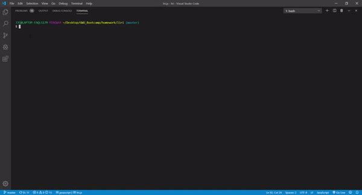

# Liri

Liri is an app to display information for: concerts, songs, and movies.

Information is brought through: BandsInTown, Spotify, and OMDB.

## Technology

This JavaScript app is built using Node.

Dependencies: Axios, Dotenv, Node-Spotify-API, Moment

## Demo

